# Re-Connect System Architecture & Workflow Documentation

## 🏗️ System Architecture Overview

### High-Level Architecture Diagram

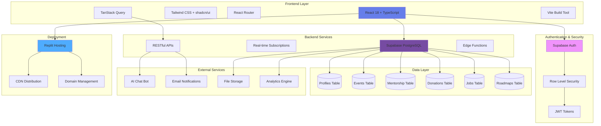

### Technology Stack Architecture

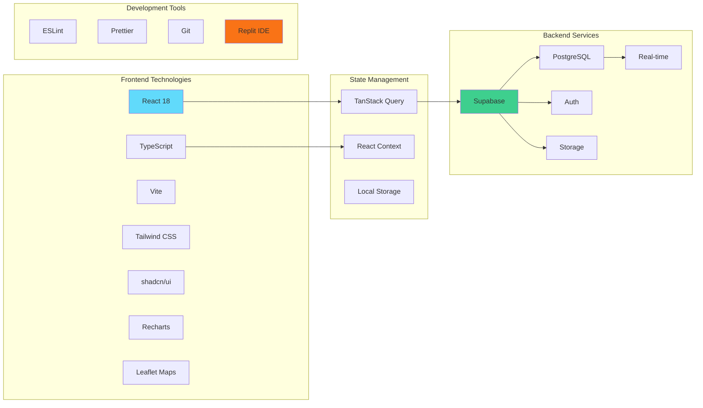

## 🔄 User Workflow Diagrams

### Student Journey Workflow

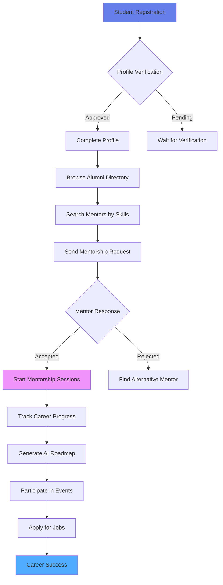

### Alumni Engagement Workflow

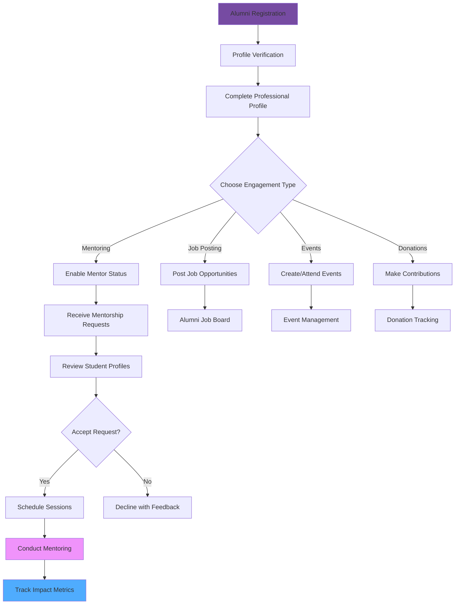

### Admin Management Workflow

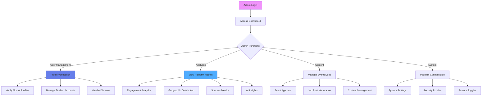

## 📊 Data Flow Architecture

### Real-time Data Flow

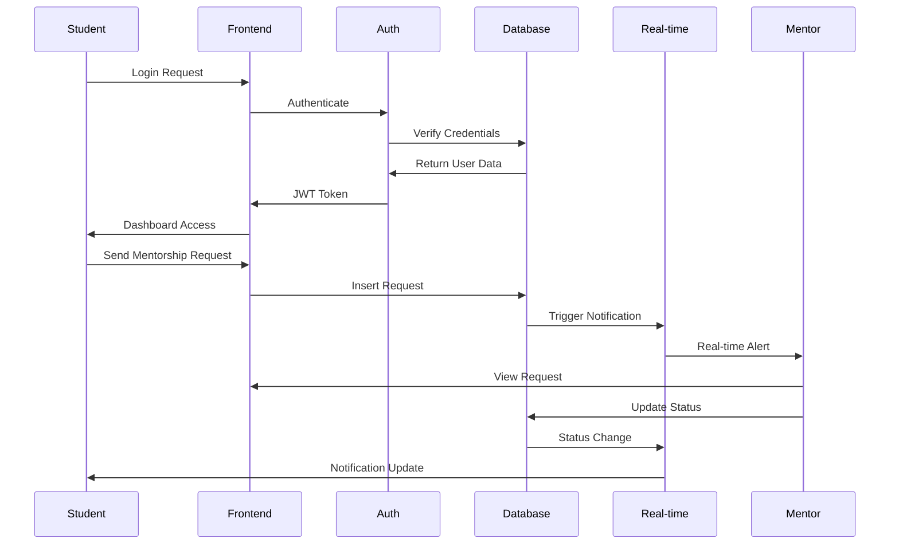

### AI Integration Flow

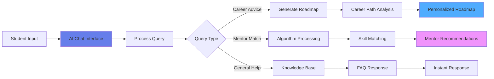

## 🗄️ Database Schema Architecture

### Core Tables Relationship

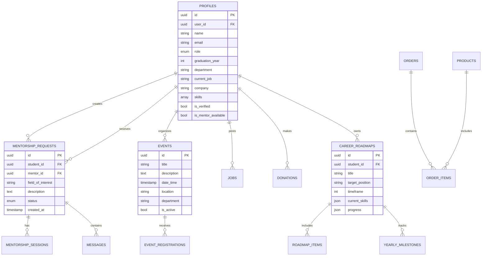

## 🔒 Security Architecture

### Authentication & Authorization Flow

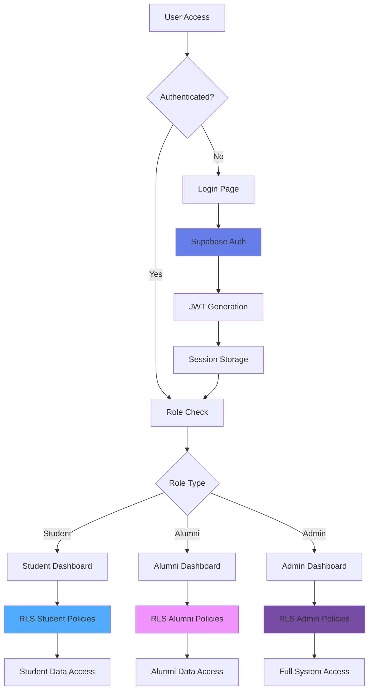

### Data Security Layers

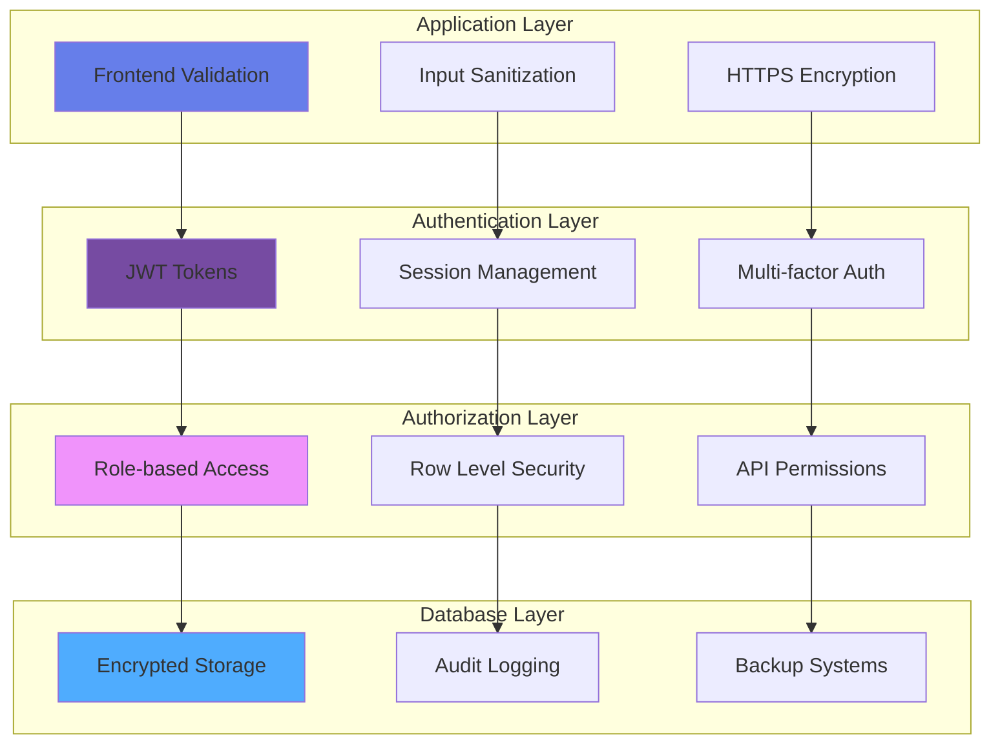

## 🚀 Deployment Architecture

### Replit Deployment Flow

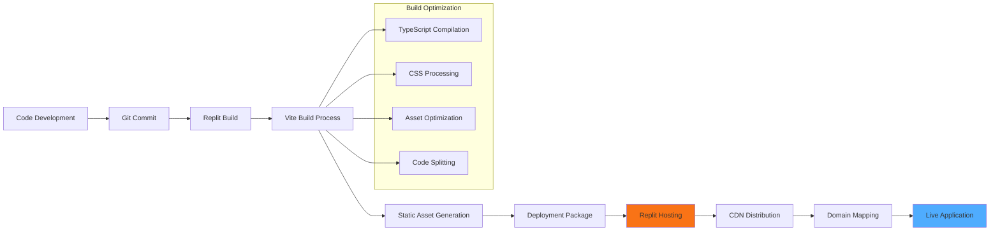

### Performance Monitoring

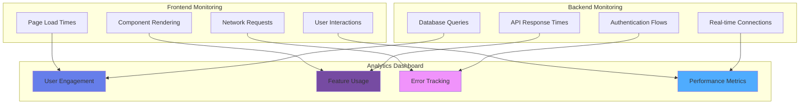

## 📈 Analytics & Insights Architecture

### AI-Powered Analytics Flow

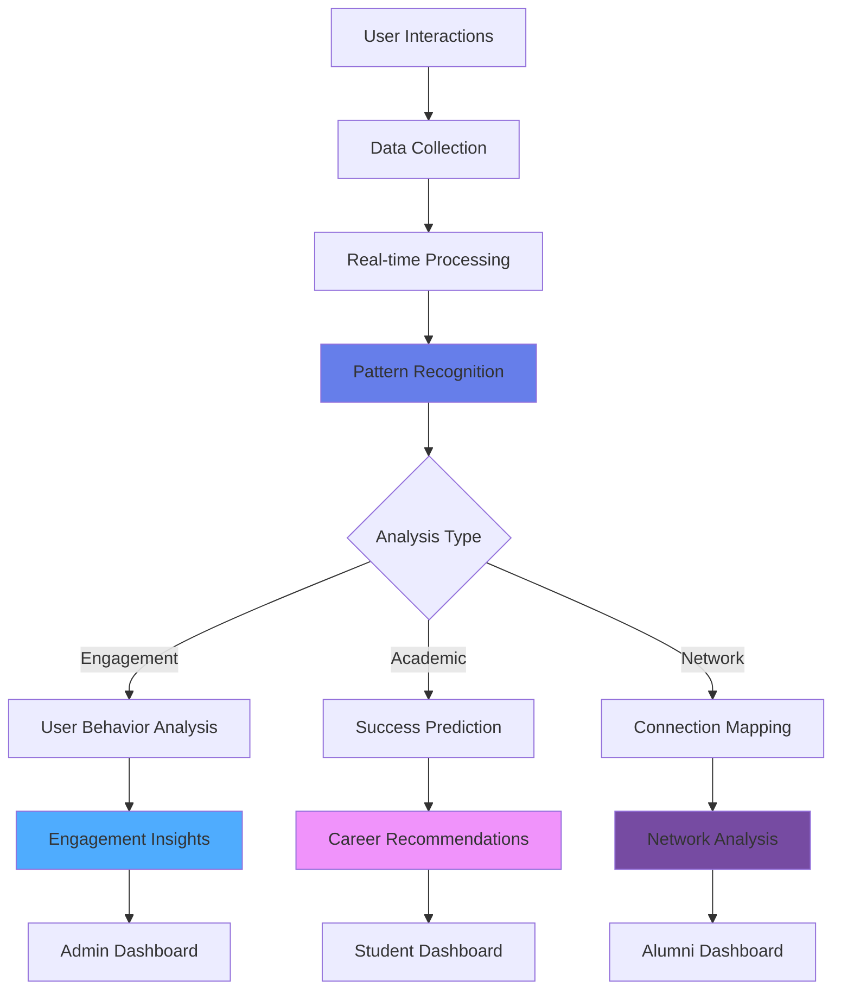

This comprehensive architecture documentation provides a complete view of the Re-Connect system, showing how all components work together to create a robust alumni data management and engagement platform. The diagrams illustrate the technical implementation, user workflows, security measures, and deployment strategy that make this SIH 2025 solution effective and scalable.
