# Re-Connect Technical Workflow Documentation

## 🔧 Development Workflow

### Local Development Process

```mermaid
gitgraph
    commit id: "Initial Setup"
    branch feature-development
    checkout feature-development
    commit id: "Component Development"
    commit id: "API Integration"
    commit id: "Testing"
    checkout main
    merge feature-development
    commit id: "Production Deploy"
```

### Code Review & Quality Assurance

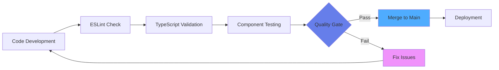

## 🗂️ File Structure & Organization

```
src/
├── components/          # Reusable UI components
│   ├── ui/             # shadcn/ui components
│   ├── CareerRoadmap.tsx
│   └── ProtectedRoute.tsx
├── contexts/           # React contexts
│   └── AuthContext.tsx
├── data/              # Mock data and constants
│   ├── mockData.ts
│   └── roadmapData.ts
├── hooks/             # Custom React hooks
│   └── use-toast.ts
├── integrations/      # External service integrations
│   └── supabase/
├── pages/            # Route components
│   ├── AdminDashboard.tsx
│   ├── StudentDashboard.tsx
│   └── AlumniDirectory.tsx
├── types/            # TypeScript type definitions
│   └── roadmap.ts
└── lib/              # Utility functions
    └── utils.ts
```

## 🎯 Feature Implementation Workflow

### Mentorship System Implementation

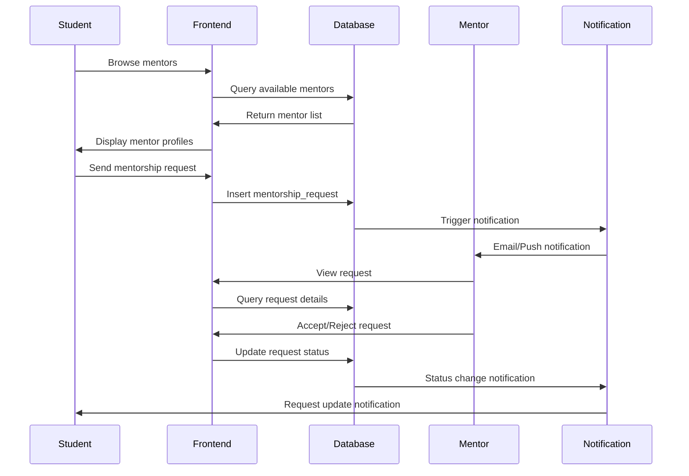

### AI Career Roadmap Generation

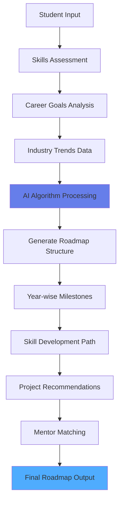

## 📊 Data Processing Workflows

### Alumni Data Verification Process

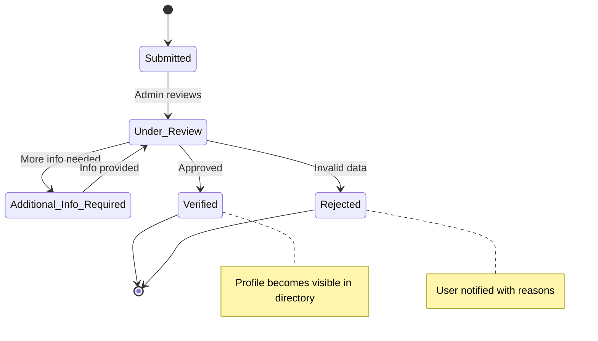

### Event Management Lifecycle

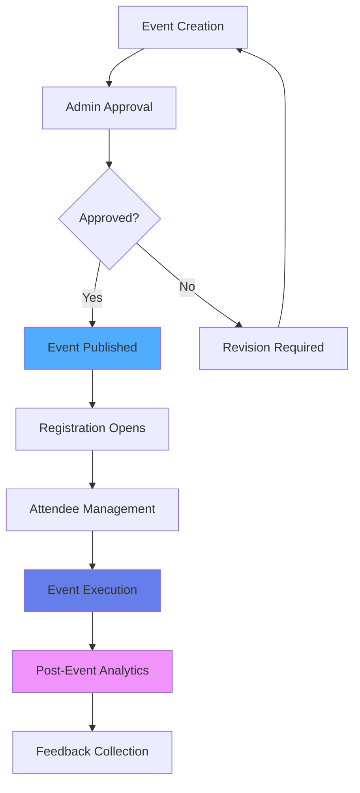

## 🔄 Real-time System Workflows

### Live Notification System

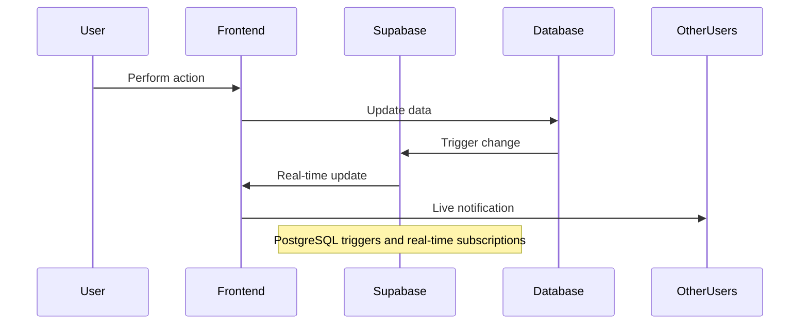

### Chat System Architecture

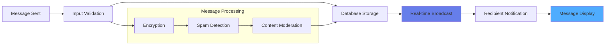

## 🎨 UI/UX Development Workflow

### Component Development Process

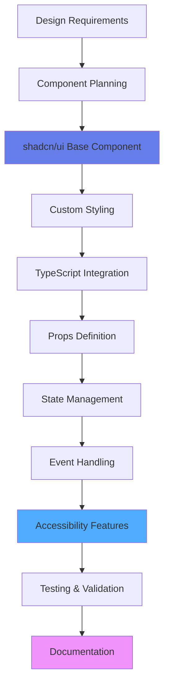

### Responsive Design Implementation

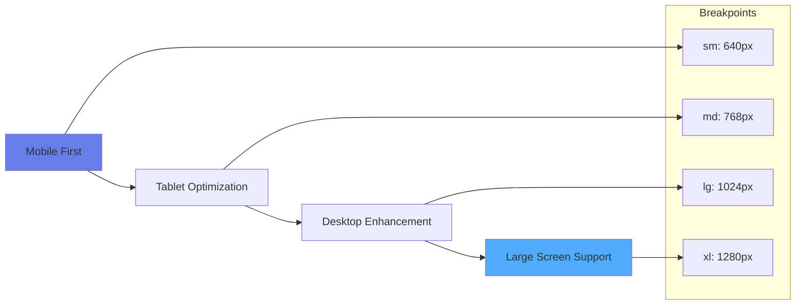

## 🔐 Security Implementation Workflow

### Authentication Flow

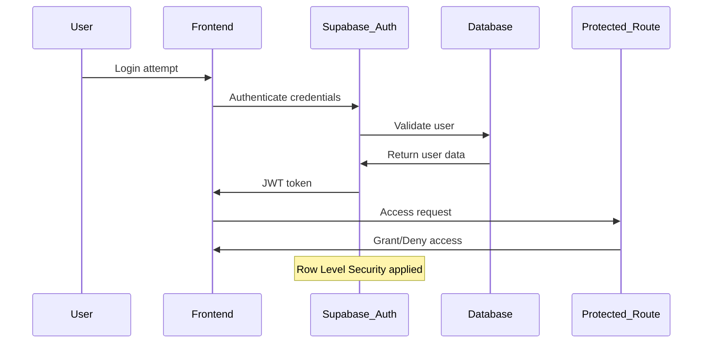

### Data Protection Measures

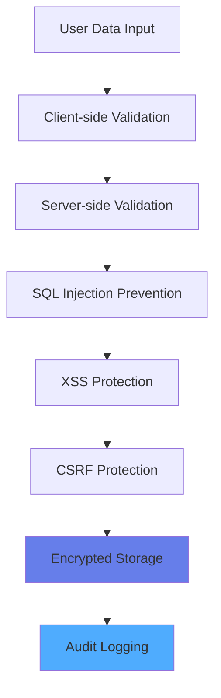

## 📈 Analytics & Monitoring Workflow

### Performance Tracking

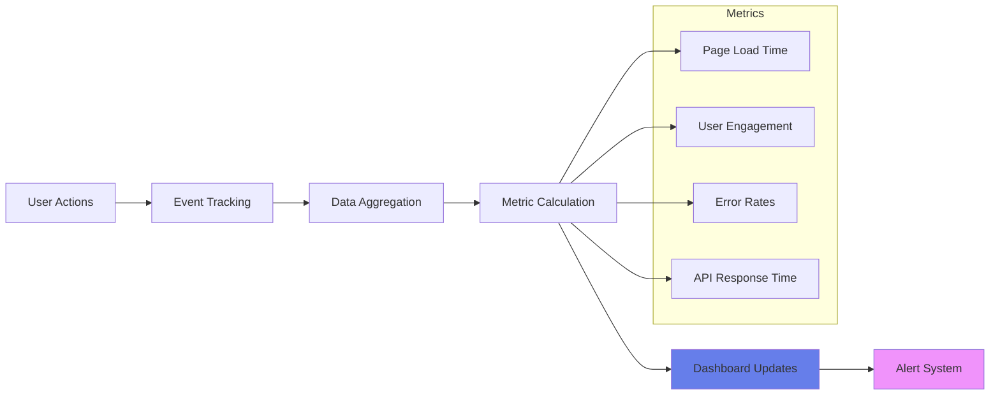

### Business Intelligence Flow

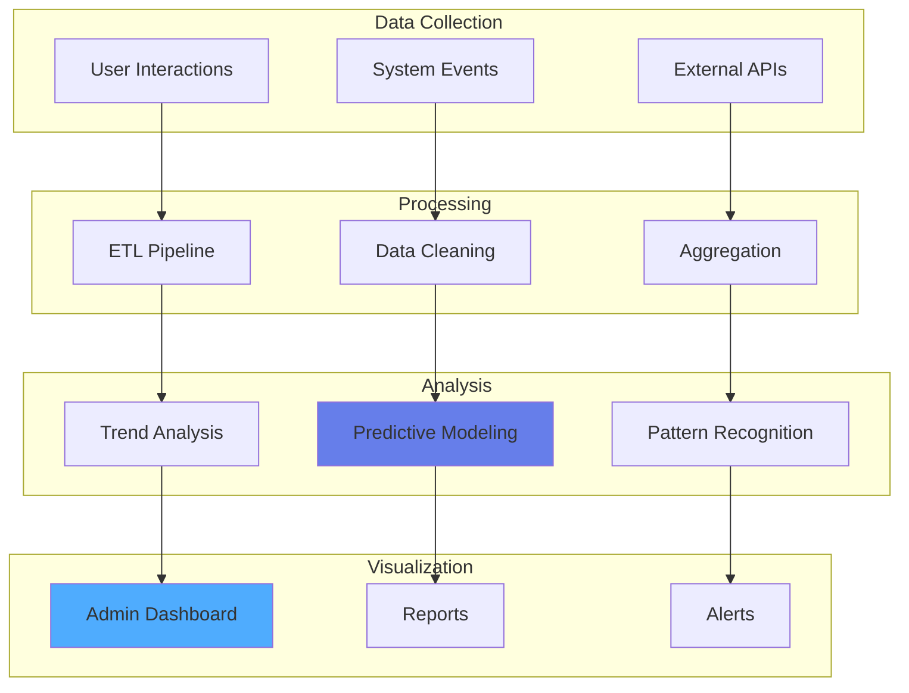

This technical workflow documentation provides a comprehensive view of how the Re-Connect system operates at the technical level, showing development processes, implementation patterns, and system interactions that ensure robust and scalable platform performance.
