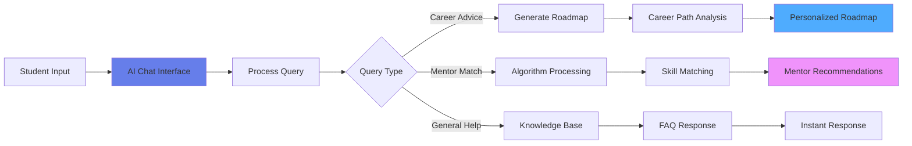

```mermaid
flowchart LR
    A[Student Input] --> B[AI Chat Interface]
    B --> C[Process Query]
    C --> D{Query Type}
    D -->|Career Advice| E[Generate Roadmap]
    D -->|Mentor Match| F[Algorithm Processing]
    D -->|General Help| G[Knowledge Base]
    E --> H[Career Path Analysis]
    F --> I[Skill Matching]
    G --> J[FAQ Response]
    H --> K[Personalized Roadmap]
    I --> L[Mentor Recommendations]
    J --> M[Instant Response]
    
    style B fill:#667eea
    style K fill:#4facfe
    style L fill:#f093fb
```
