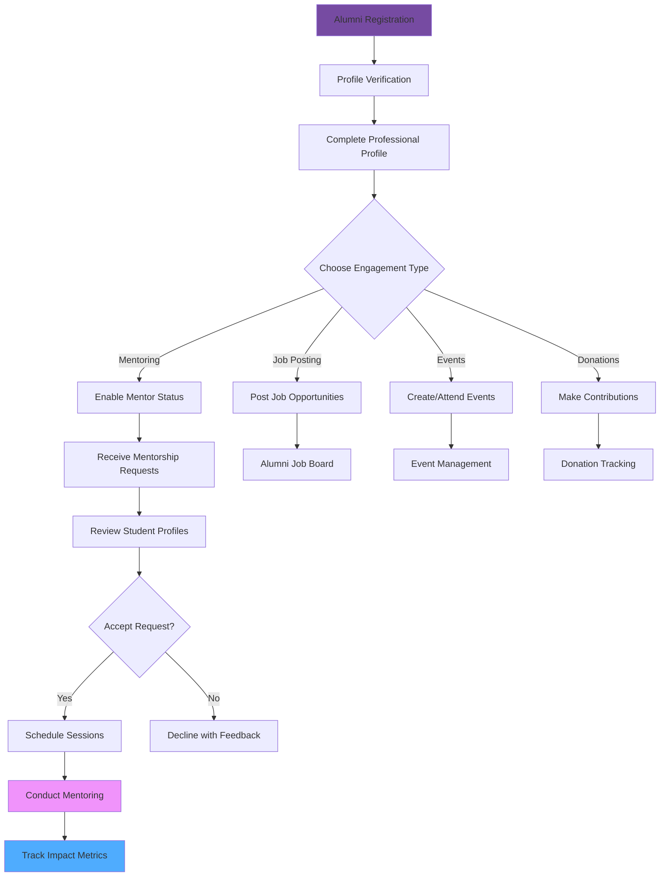

```mermaid
flowchart TD
    A[Alumni Registration] --> B[Profile Verification]
    B --> C[Complete Professional Profile]
    C --> D{Choose Engagement Type}
    D -->|Mentoring| E[Enable Mentor Status]
    D -->|Job Posting| F[Post Job Opportunities]
    D -->|Events| G[Create/Attend Events]
    D -->|Donations| H[Make Contributions]
    E --> I[Receive Mentorship Requests]
    I --> J[Review Student Profiles]
    J --> K{Accept Request?}
    K -->|Yes| L[Schedule Sessions]
    K -->|No| M[Decline with Feedback]
    L --> N[Conduct Mentoring]
    N --> O[Track Impact Metrics]
    F --> P[Alumni Job Board]
    G --> Q[Event Management]
    H --> R[Donation Tracking]
    
    style A fill:#764ba2
    style N fill:#f093fb
    style O fill:#4facfe
```
