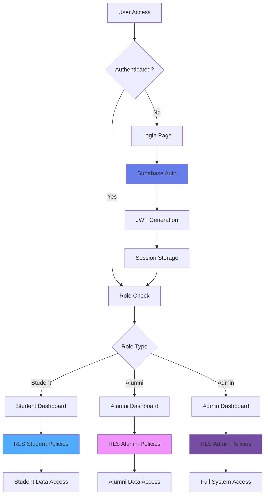

```mermaid
flowchart TD
    A[User Access] --> B{Authenticated?}
    B -->|No| C[Login Page]
    B -->|Yes| D[Role Check]
    C --> E[Supabase Auth]
    E --> F[JWT Generation]
    F --> G[Session Storage]
    G --> D
    D --> H{Role Type}
    H -->|Student| I[Student Dashboard]
    H -->|Alumni| J[Alumni Dashboard]
    H -->|Admin| K[Admin Dashboard]
    
    I --> L[RLS Student Policies]
    J --> M[RLS Alumni Policies]
    K --> N[RLS Admin Policies]
    
    L --> O[Student Data Access]
    M --> P[Alumni Data Access]
    N --> Q[Full System Access]
    
    style E fill:#667eea
    style L fill:#4facfe
    style M fill:#f093fb
    style N fill:#764ba2
```
