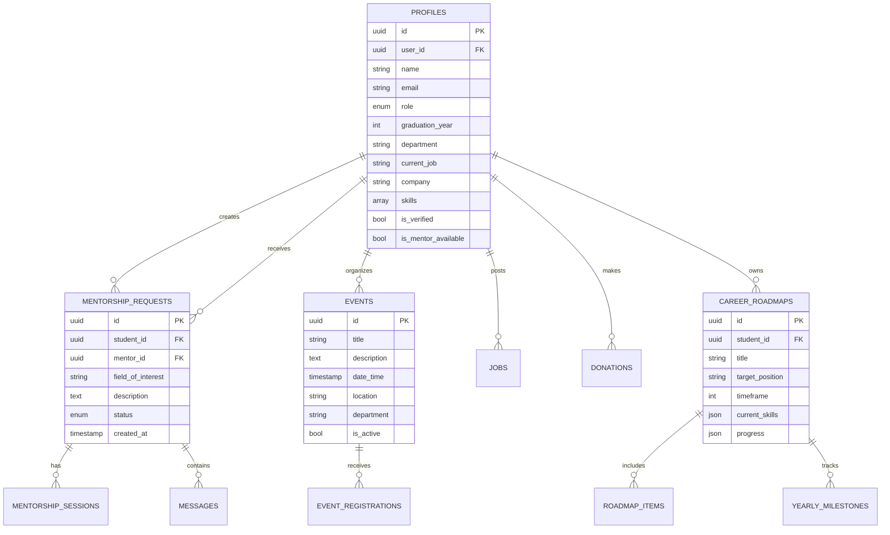

```mermaid
erDiagram
    PROFILES ||--o{ MENTORSHIP_REQUESTS : creates
    PROFILES ||--o{ MENTORSHIP_REQUESTS : receives
    PROFILES ||--o{ EVENTS : organizes
    PROFILES ||--o{ JOBS : posts
    PROFILES ||--o{ DONATIONS : makes
    PROFILES ||--o{ CAREER_ROADMAPS : owns
    
    MENTORSHIP_REQUESTS ||--o{ MENTORSHIP_SESSIONS : has
    MENTORSHIP_REQUESTS ||--o{ MESSAGES : contains
    CAREER_ROADMAPS ||--o{ ROADMAP_ITEMS : includes
    CAREER_ROADMAPS ||--o{ YEARLY_MILESTONES : tracks
    EVENTS ||--o{ EVENT_REGISTRATIONS : receives
    
    PROFILES {
        uuid id PK
        uuid user_id FK
        string name
        string email
        enum role
        int graduation_year
        string department
        string current_job
        string company
        array skills
        bool is_verified
        bool is_mentor_available
    }
    
    MENTORSHIP_REQUESTS {
        uuid id PK
        uuid student_id FK
        uuid mentor_id FK
        string field_of_interest
        text description
        enum status
        timestamp created_at
    }
    
    EVENTS {
        uuid id PK
        string title
        text description
        timestamp date_time
        string location
        string department
        bool is_active
    }
    
    CAREER_ROADMAPS {
        uuid id PK
        uuid student_id FK
        string title
        string target_position
        int timeframe
        json current_skills
        json progress
    }
```
