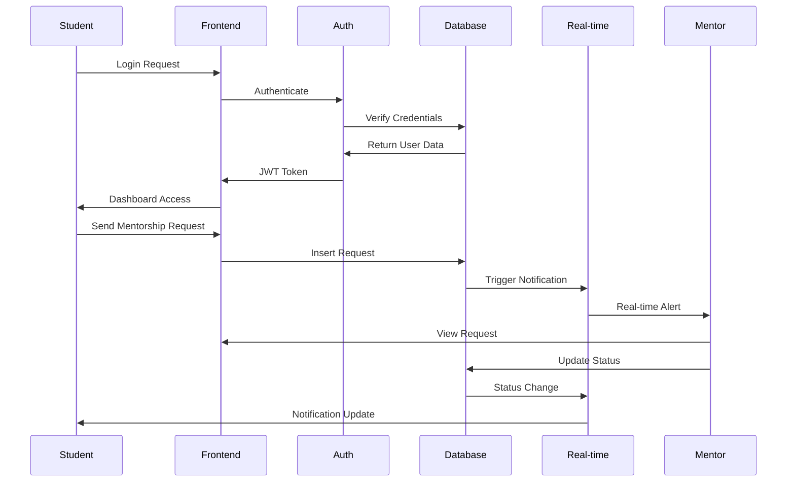

```mermaid
sequenceDiagram
    participant S as Student
    participant F as Frontend
    participant A as Auth
    participant D as Database
    participant R as Real-time
    participant M as Mentor
    
    S->>F: Login Request
    F->>A: Authenticate
    A->>D: Verify Credentials
    D->>A: Return User Data
    A->>F: JWT Token
    F->>S: Dashboard Access
    
    S->>F: Send Mentorship Request
    F->>D: Insert Request
    D->>R: Trigger Notification
    R->>M: Real-time Alert
    M->>F: View Request
    M->>D: Update Status
    D->>R: Status Change
    R->>S: Notification Update
```
