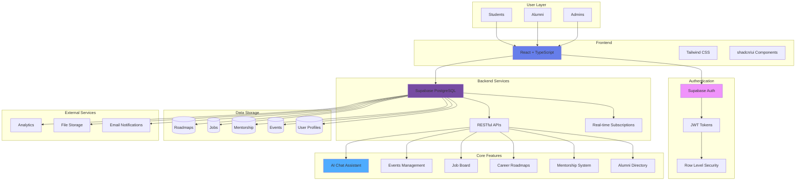

```mermaid
graph TB
    subgraph "User Layer"
        A[Students]
        B[Alumni]
        C[Admins]
    end
    
    subgraph "Frontend"
        D[React + TypeScript]
        E[Tailwind CSS]
        F[shadcn/ui Components]
    end
    
    subgraph "Authentication"
        G[Supabase Auth]
        H[JWT Tokens]
        I[Row Level Security]
    end
    
    subgraph "Backend Services"
        J[Supabase PostgreSQL]
        K[Real-time Subscriptions]
        L[RESTful APIs]
    end
    
    subgraph "Core Features"
        M[Alumni Directory]
        N[Mentorship System]
        O[Career Roadmaps]
        P[Job Board]
        Q[Events Management]
        R[AI Chat Assistant]
    end
    
    subgraph "Data Storage"
        S[(User Profiles)]
        T[(Events)]
        U[(Mentorship)]
        V[(Jobs)]
        W[(Roadmaps)]
    end
    
    subgraph "External Services"
        X[Email Notifications]
        Y[File Storage]
        Z[Analytics]
    end
    
    A --> D
    B --> D
    C --> D
    D --> G
    D --> J
    G --> H
    H --> I
    J --> K
    J --> L
    L --> M
    L --> N
    L --> O
    L --> P
    L --> Q
    L --> R
    J --> S
    J --> T
    J --> U
    J --> V
    J --> W
    J --> X
    J --> Y
    J --> Z
    
    style D fill:#667eea
    style J fill:#764ba2
    style G fill:#f093fb
    style R fill:#4facfe
```
