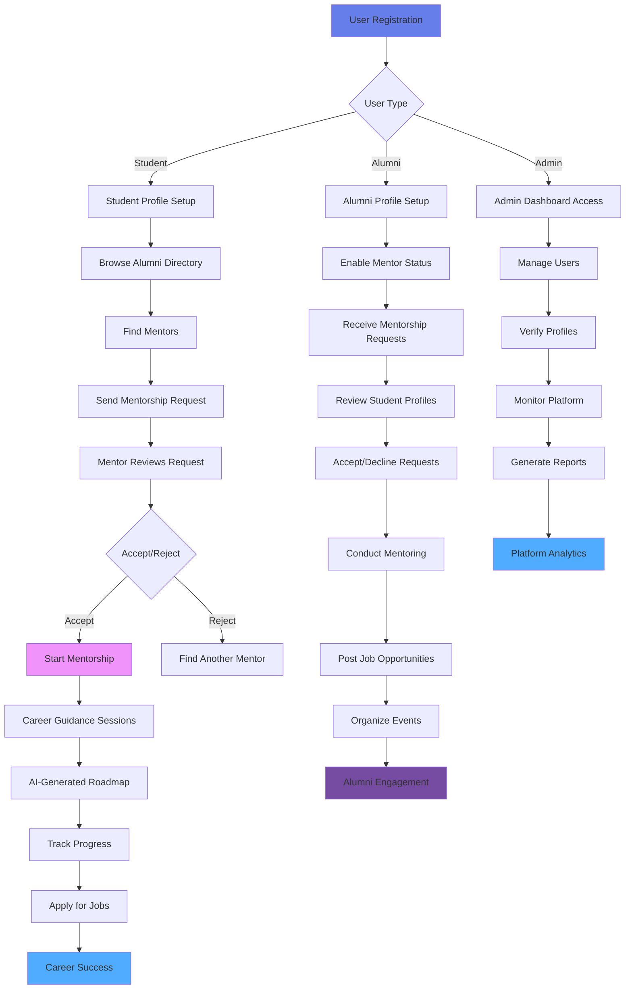

```mermaid
flowchart TD
    A[User Registration] --> B{User Type}
    B -->|Student| C[Student Profile Setup]
    B -->|Alumni| D[Alumni Profile Setup]
    B -->|Admin| E[Admin Dashboard Access]
    
    C --> F[Browse Alumni Directory]
    F --> G[Find Mentors]
    G --> H[Send Mentorship Request]
    H --> I[Mentor Reviews Request]
    I --> J{Accept/Reject}
    J -->|Accept| K[Start Mentorship]
    J -->|Reject| L[Find Another Mentor]
    K --> M[Career Guidance Sessions]
    M --> N[AI-Generated Roadmap]
    N --> O[Track Progress]
    O --> P[Apply for Jobs]
    P --> Q[Career Success]
    
    D --> R[Enable Mentor Status]
    R --> S[Receive Mentorship Requests]
    S --> T[Review Student Profiles]
    T --> U[Accept/Decline Requests]
    U --> V[Conduct Mentoring]
    V --> W[Post Job Opportunities]
    W --> X[Organize Events]
    X --> Y[Alumni Engagement]
    
    E --> Z[Manage Users]
    Z --> AA[Verify Profiles]
    AA --> BB[Monitor Platform]
    BB --> CC[Generate Reports]
    CC --> DD[Platform Analytics]
    
    style A fill:#667eea
    style K fill:#f093fb
    style Q fill:#4facfe
    style Y fill:#764ba2
    style DD fill:#4facfe
```
