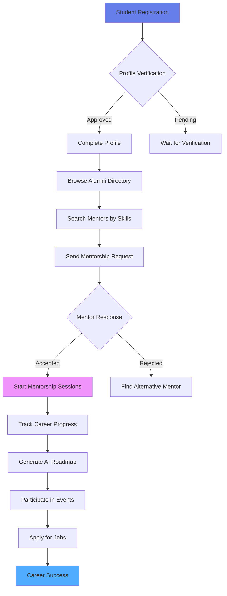

```mermaid
flowchart TD
    A[Student Registration] --> B{Profile Verification}
    B -->|Approved| C[Complete Profile]
    B -->|Pending| D[Wait for Verification]
    C --> E[Browse Alumni Directory]
    E --> F[Search Mentors by Skills]
    F --> G[Send Mentorship Request]
    G --> H{Mentor Response}
    H -->|Accepted| I[Start Mentorship Sessions]
    H -->|Rejected| J[Find Alternative Mentor]
    I --> K[Track Career Progress]
    K --> L[Generate AI Roadmap]
    L --> M[Participate in Events]
    M --> N[Apply for Jobs]
    N --> O[Career Success]
    
    style A fill:#667eea
    style O fill:#4facfe
    style I fill:#f093fb
```
