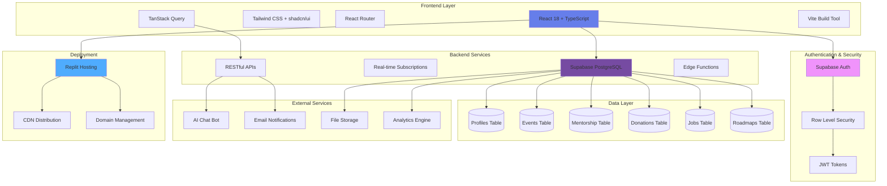

```mermaid
graph TB
    subgraph "Frontend Layer"
        A[React 18 + TypeScript]
        B[Tailwind CSS + shadcn/ui]
        C[React Router]
        D[TanStack Query]
        E[Vite Build Tool]
    end
    
    subgraph "Authentication & Security"
        F[Supabase Auth]
        G[Row Level Security]
        H[JWT Tokens]
    end
    
    subgraph "Backend Services"
        I[Supabase PostgreSQL]
        J[Real-time Subscriptions]
        K[RESTful APIs]
        L[Edge Functions]
    end
    
    subgraph "Data Layer"
        M[(Profiles Table)]
        N[(Events Table)]
        O[(Mentorship Table)]
        P[(Donations Table)]
        Q[(Jobs Table)]
        R[(Roadmaps Table)]
    end
    
    subgraph "External Services"
        S[AI Chat Bot]
        T[Email Notifications]
        U[File Storage]
        V[Analytics Engine]
    end
    
    subgraph "Deployment"
        W[Replit Hosting]
        X[CDN Distribution]
        Y[Domain Management]
    end
    
    A --> F
    A --> I
    D --> K
    F --> G
    G --> H
    I --> M
    I --> N
    I --> O
    I --> P
    I --> Q
    I --> R
    K --> S
    K --> T
    I --> U
    I --> V
    A --> W
    W --> X
    W --> Y
    
    style A fill:#667eea
    style I fill:#764ba2
    style F fill:#f093fb
    style W fill:#4facfe
```
